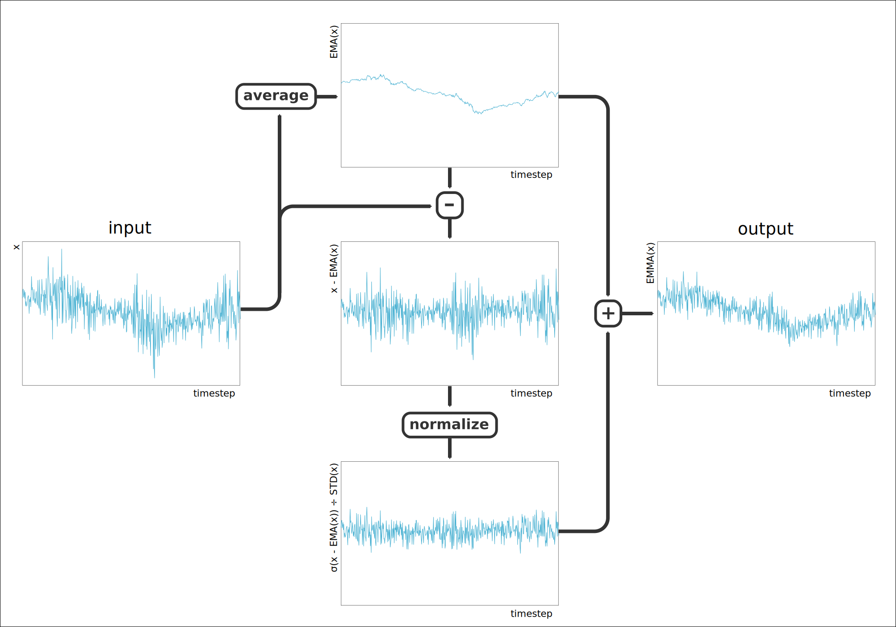
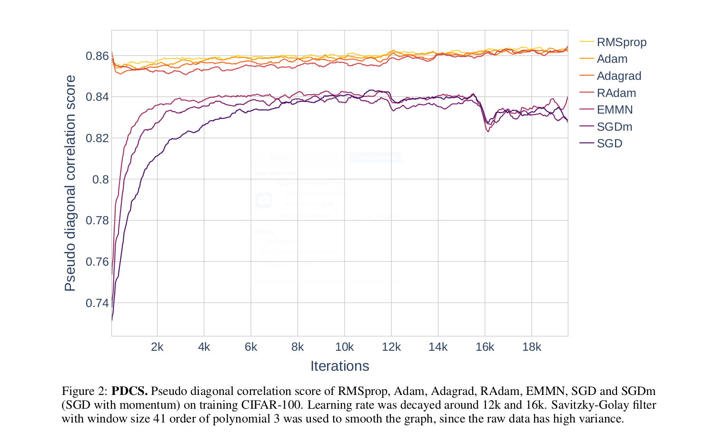
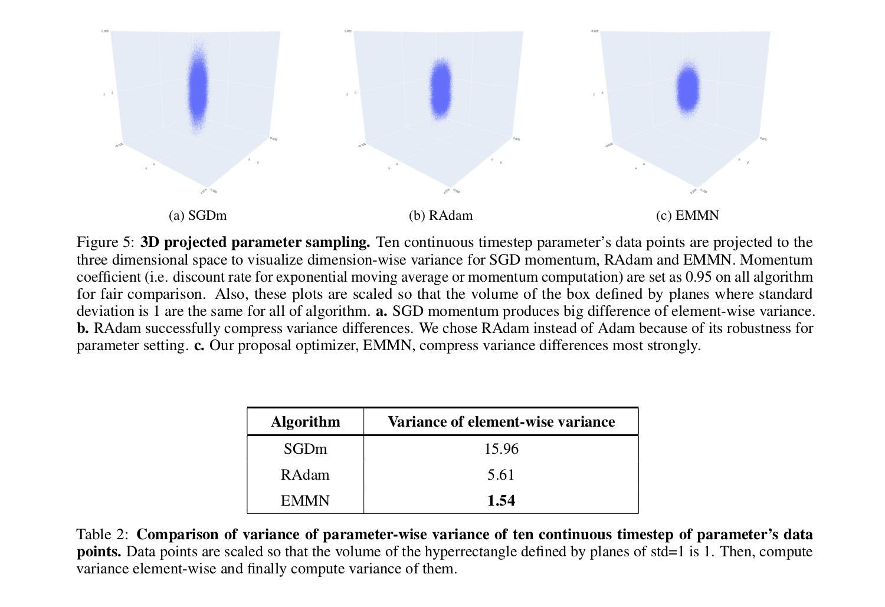
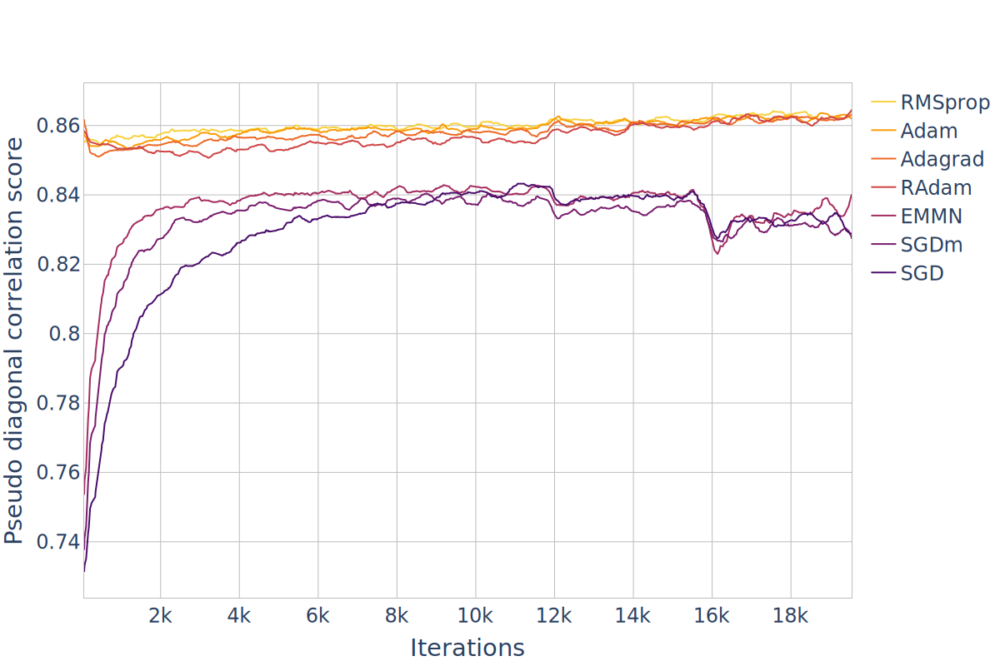
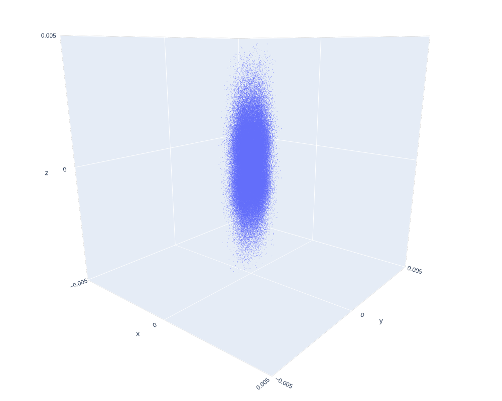
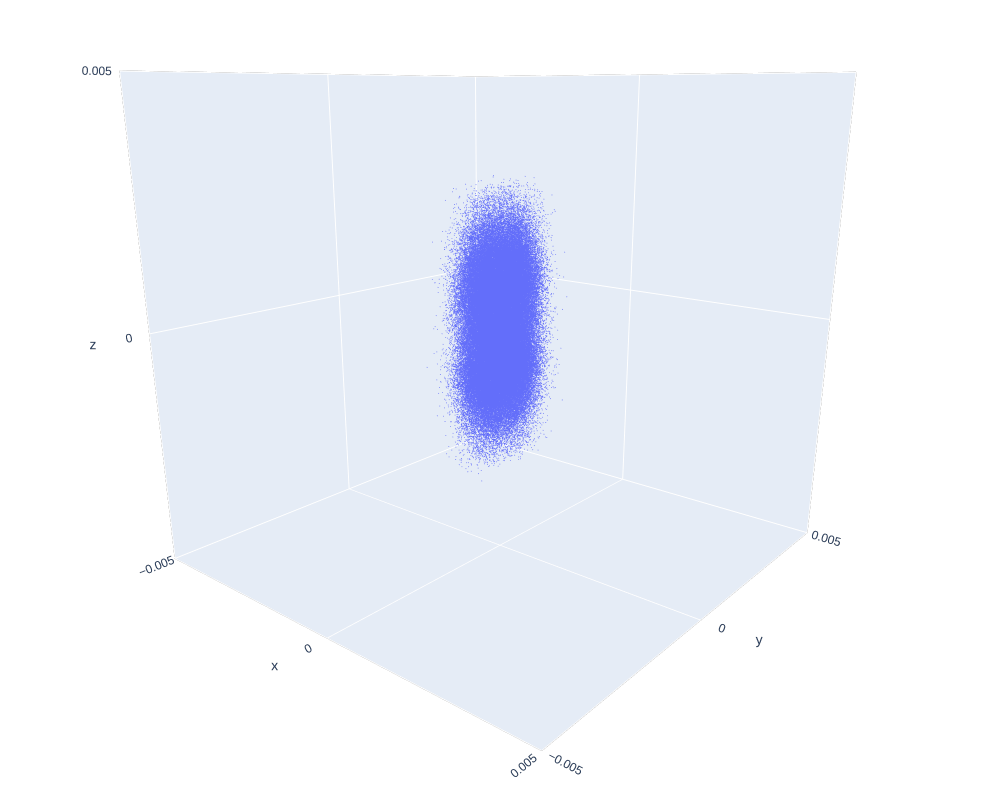
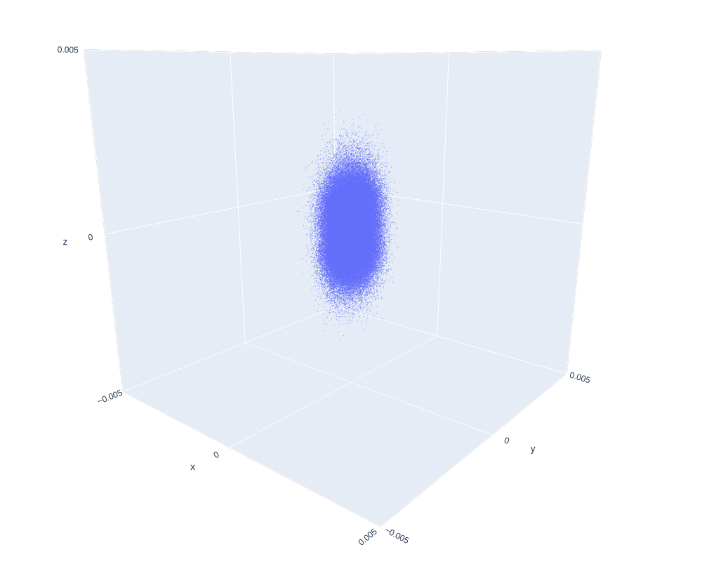
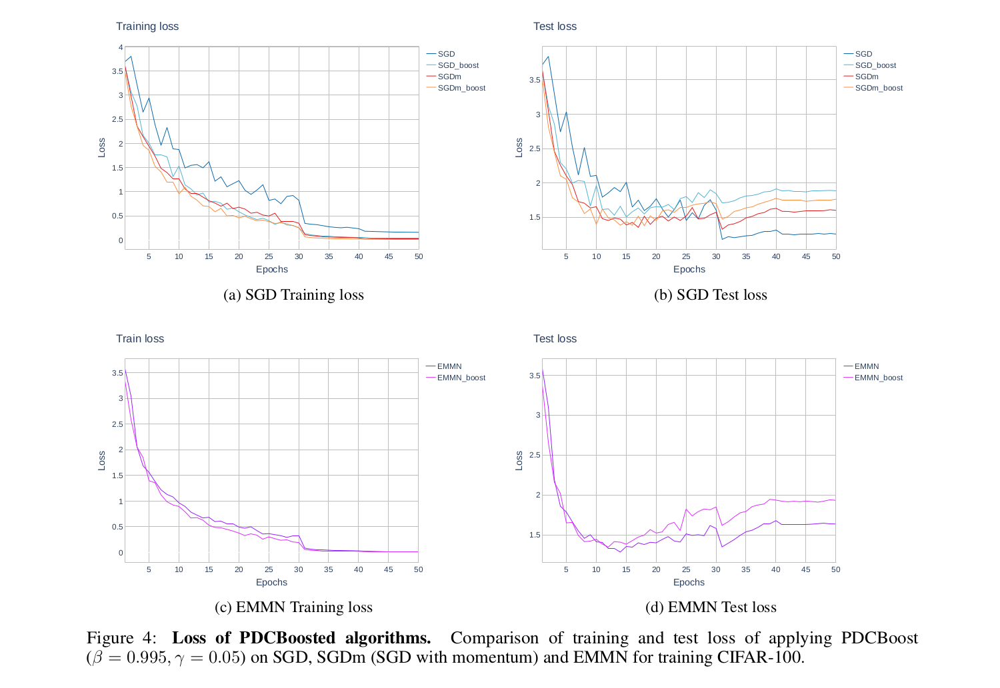

<h1 align="center">EMMN</h1>
<h5 align="center">Exponential Mean-centric Moving Normalization for Optimization Algorithm</h5>

<div align="center"><a href="https://www.academia.edu/44007671/EMMN_Exponential_Mean_centric_Moving_Normalization_for_Stochastic_Optimization">download the paper</a></div>


working in progress.

- [Introduction](#Introduction)
- [Motivation](#Motivation)
- [SLSBoost](#SLSBoost)
- [Quick Start Guide](#quick-start-guide)

<!-- - [Citation](#citation) -->


## Introduction

EMMN is a new stochastic gradient-based optimization algorithm designed to provide the speed of adaptive methods while maintaining the generalization ability of non adaptive methods.

In this algorithm, we first decompose the gradient into two parts, one is the momentum component and the other is the residual component (i.e. gradient - momentum). Then, the residual component is normalized by the moving estimation of the standard deviation. Finally, these two components are added together and is used to update parameters. This is illustrated bellow.

<p align="center"></p>

**Figure 1 : Visualization of EMMA algorithm.**

Since this algorithm normalize gradient as if the point of the estimated moving average (i.e. momentum) is the center (i.e. zero), momentum is not affected by the normalization. Hence, momentum is invariant. This explicitly mitigate the problem of *diagonal correlated trajectory*, a latent property of adaptive optimization algorithm, which is identified and explained in [the paper](https://www.academia.edu/44007671/EMMN_Exponential_Mean_centric_Moving_Normalization_for_Stochastic_Optimization). Since gradient is divided by running estimated standard deviation at each time step, the fluctuation of the parameter moving has the similar radius from the estimated center for each element. This enables *soft-homoscedastic gradient sampling* which brings informative momentum estimation.


## Motivation

In this study, we theoretically derived the following two conjectures as the properties of the adaptive optimization algorithms.

- Diagonal correlated trajectory
- Soft-homoscedastic gradient sampling

We empirically showed the existence of these two properties,  as shown in Figure 2 for diagonal correlated trajectory, Figure 5 and table 2 for soft-homoscedastic gradient sampling.






<!--We empirically showed the existence of these two properties,  as shown in Figure 2 for diagonal correlated trajectory, Figure 3 and table 1 for soft-homoscedastic gradient sampling.



**Figure 2 : PDC scores.** PDC score of RMSprop, Adam, Adagrad, RAdam, EMMN, SGD and  SGDm (SGD with momentum) on training CIFAR-100. Learning rate was decayed around 12k and 16k. Savitzky-Golay filter with window size 41 order of polynomial 3 was used to smooth the graph, since the raw data has high variance.


<div style="display: flex">
<table style="width: 48%; margin-right:2%">
  <tr>
    <th>Algorithm</th>
    <th>variance of element-wise variance</th>
  </tr>
  <tr>
    <td>SGD momentum</td>
    <td>15.96</td>
  </tr>
  <tr>
    <td>RAdam</td>
    <td>5.61</td>
  </tr>
  <tr>
    <td>EMMN</td>
      <td><strong>1.54</strong></td>
  </tr>
</table>
<div style="width: 48%; margin-left:2%">
    <strong>Table 1: Comparison of variance of parameter-wise variance of ten continuous timestep of parameter's data points.</strong> Data points are scaled so that the volume of the hyperrectangle defined by planes of std=1 is 1. Then, compute variance element-wise and finally compute variance of them.
</div>
</div>

<div style="display: flex">
    <div style="width: 31%; margin-left:2.3%"><strong>a.</strong> SGD momentum</div>
    <div style="width: 31%; margin-left:2.3%"><strong>b.</strong> RAdam</div>
    <div style="width: 31%; margin-left:2.3%"><strong>c.</strong> EMMN</div>
</div>
<div style="display: flex">
    
    
    
</div>
**Figure 3: 3D projected parameter sampling.** Ten continuous timestep parameter's data points are projected to the three dimensional space to visualize dimension-wise variance for SGD momentum, RAdam and EMMN. Momentum coefficient (i.e. discount rate for exponential moving average or momentum computation) are set as 0.95 on all algorithm for fair comparison. Also, these plots are scaled so that the volume of the box defined by planes where standard deviation is 1 are the same for all of algorithm.  **a.** SGD momentum produces big difference of element-wise variance. **b.** RAdam successfully compress variance differences. We chose RAdam instead of Adam because of its robustness for parameter setting. **c.** Our proposal optimizer, EMMN, compress variance differences most strongly.-->

Our study suggest diagonal correlated trajectory causes high-variance, thus lower generalization ability as show in Figure 4. We theoretically show soft-homoscedastic gradient sampling has advantage in the paper. Please refer [the paper](https://www.academia.edu/44007671/EMMN_Exponential_Mean_centric_Moving_Normalization_for_Stochastic_Optimization) for the detail.



*Our motivation is to cancel  the diagonal correlation of parameters trajectory while keeping soft-homoscedastic gradient sampling.*


## SLSBoost

SLSBoost is sub-algorithm for gradient-based optimization algorithm to speed up the learning process.

Based on our studies on the trajectories of the learning parameters, we hypothesize that high diagonal correlations of the trajectories of the learning parameters lead to higher straight line stability of the trajectories, and that high straight line stability is a direct cause of the improvement in learning speed.

Our experiments have shown that by increasing straight line stability without increasing diagonal correlation, it is possible to improve training speed while minimizing generalized performance degradation.

*SLSBoost algorithm boosts straight line stability of the parameter trajectories without increasing diagonal correlation of the trajectories.* The algorithm is implemented experimentally in this pytorch implementation of the EMMN.

This section is a work in progress.


## Quick Start Guide

EMMN can be easily replace from SGD momentum by converting learning rate from SGD to EMMN using the bellow equation.

<!-- $$
\frac{\alpha_{sgd}}{(1 - \beta_{sgd})} = \alpha_{emmn}
$$ --> 

<div align="center"></div>

Where α is leraning rate, βsgd is momentum factor of SGD. For example, if βsgd = 0.95 and αsgd = 0.15, learning rate of EMMN is:

<!-- $$
\alpha_{emmn} = \frac{\alpha_{sgd}}{1 - \beta_{sgd}} = \frac{0.15}{1 - 0.95} = 3
$$ --> 

<div align="center"></div>

We recommend setting β of EMMN to 0.95 for the first time, and then adjusting it between 0.9 and 0.99 if necessary.

If you need to further speed up the learning process, try SLSBoost. We  haven't fully experimented with it yet, but for now we would recommend something around sls_boost=(0.05, 0.995) or  (0.3, 0.95) or in between.


<!-- ## Citation

If you find our algorithm useful, please cite the following paper.

> Tadanobu Ohata (2020). EMMN: Exponential Mean-centric Moving Normalization for Stochastic Optimization

```
@article{,
  title={EMMN: Exponential Mean-centric Moving Normalization for Stochastic Optimization},
  author={Tadanobu Ohata},
  journal={},
  year={}
}
``` -->

